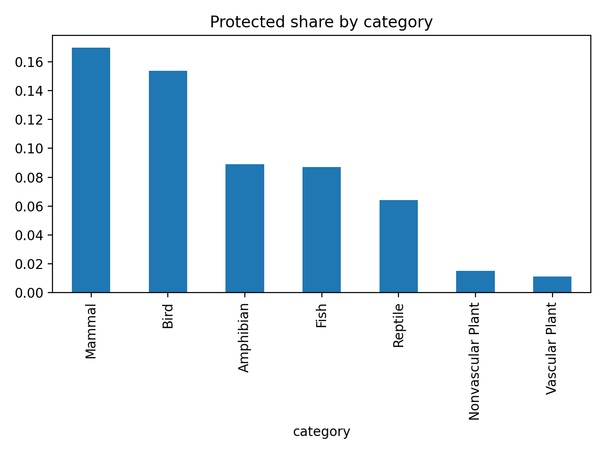

# Biodiversity Analysis (Codecademy)

**Goal.** Explore species protection by category and across parks; communicate findings in a short deck.

## Data
- `species_info.csv` — category, scientific_name, common_names, conservation_status  
- `observations.csv` — scientific_name, park_name, observations (last 7 days)

## Methods
- Pandas EDA (`groupby`, `value_counts`, pivot)
- Flag `is_protected = conservation_status != "No Intervention"`
- Chi-squared test for association: `category × is_protected`  
  **Result:** χ²≈469.5, df=6, p≈3.10e-98 → **significant**

## Key Findings
- Highest protected share: **Mammal (~17%)**, **Bird (~15%)**; plants ~1–1.5%.
- Park-level: protected observations are a small fraction (~2.7–2.9%) of totals; compare both counts **and** shares.
- Recommendation: prioritize categories with high protected share; report per-park counts + shares to control effort bias.

## Charts



## Slide Deck
Download: [`slides/Biodiversity_Deck.pptx`](slides/Biodiversity_Deck.pptx)

## Reproduce
```bash
py -m venv .venv
.\.venv\Scripts\Activate
python -m pip install -r requirements.txt
python -m notebook
# open Biodiversity.ipynb
